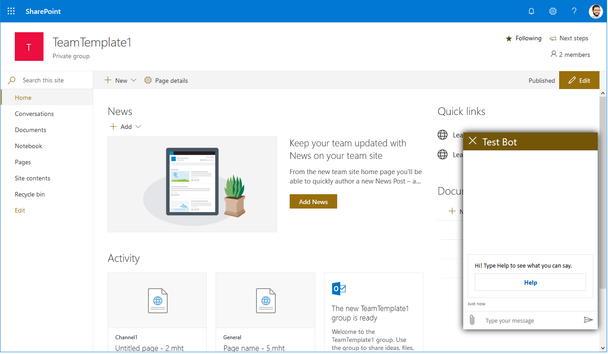

# AtBot Protype
This is a fork of the SpFx extension sample avilable at https://github.com/MickH3/directline-bot-extension.  Codebase has been updated to run with SpFx 1.8.2 and React.

Detailed instructions & tutorial on the blog post at https://github.com/withum-digital/directline-bot-extension-blog

## directline-bot-extension

A starting point SPFx extension to add a DirectLine Bot Framework bot to your SharePoint pages.



### Building the code

```bash
git clone the repo
npm i
npm i -g gulp
gulp
```

This package produces the following:

## Files generated during build
* lib/* - intermediate-stage commonjs build artifacts
* dist/* - the bundled script, along with other resources

## Files to be added to SharePoint
* sharepoint/solution/directline-bot-extension.sppkg - the SharePoint app file to be uploaded to your App Catalog

## Test/Build options

### Starts the local server to host the extension.
gulp serve --nobrowser 

### Paste the following at the end of any SharePoint modern page in your tenant to test/debug
> Be sure to update the properties noted in the JSON (DirectLineSecret, BotName)

?loadSPFX=true&debugManifestsFile=https://localhost:4321/temp/manifests.js&customActions={"15be81a7-b6b8-4a75-8de3-0da288492e77":{"location":"ClientSideExtension.ApplicationCustomizer","properties":{"DirectLineSecret":"b8SE7pQLcjM.q4HbLlxpaGgt8QvAuBVtqgjbbI2CurwxnxhtP52hcrs", "BotName": "Withum IT Bot"}}}

### Deployment
gulp bundle --ship

gulp package-solution --ship


# License
Copyright 2019 Withum

Permission is hereby granted, free of charge, to any person obtaining a copy of this software and associated documentation files (the "Software"), to deal in the Software without restriction, including without limitation the rights to use, copy, modify, merge, publish, distribute, sublicense, and/or sell copies of the Software, and to permit persons to whom the Software is furnished to do so, subject to the following conditions:

The above copyright notice and this permission notice shall be included in all copies or substantial portions of the Software.

THE SOFTWARE IS PROVIDED "AS IS", WITHOUT WARRANTY OF ANY KIND, EXPRESS OR IMPLIED, INCLUDING BUT NOT LIMITED TO THE WARRANTIES OF MERCHANTABILITY, FITNESS FOR A PARTICULAR PURPOSE AND NONINFRINGEMENT. IN NO EVENT SHALL THE AUTHORS OR COPYRIGHT HOLDERS BE LIABLE FOR ANY CLAIM, DAMAGES OR OTHER LIABILITY, WHETHER IN AN ACTION OF CONTRACT, TORT OR OTHERWISE, ARISING FROM, OUT OF OR IN CONNECTION WITH THE SOFTWARE OR THE USE OR OTHER DEALINGS IN THE SOFTWARE.
